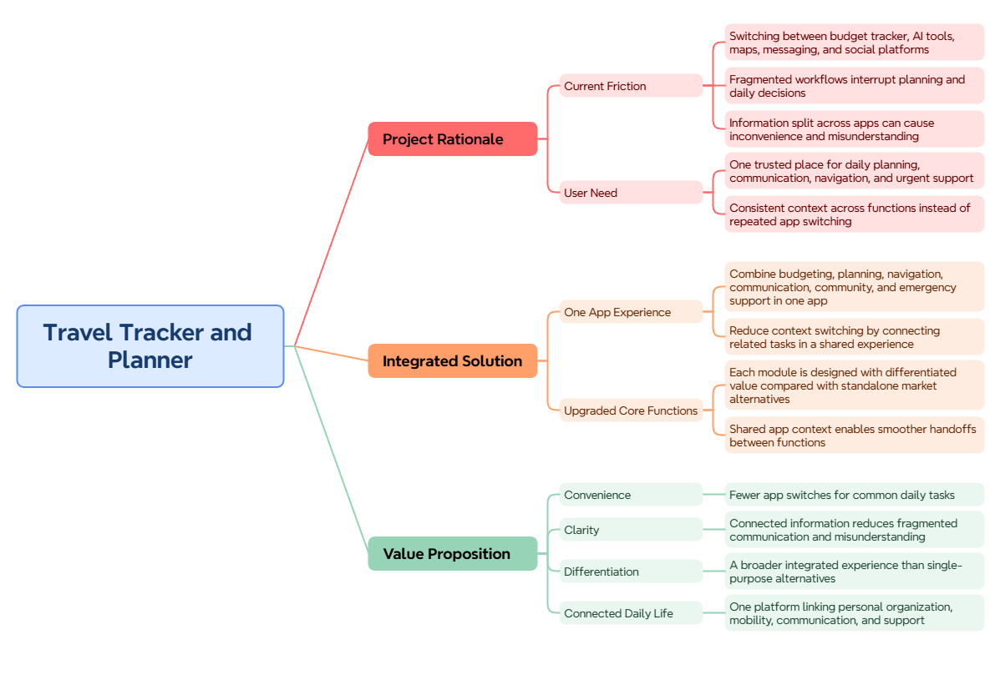
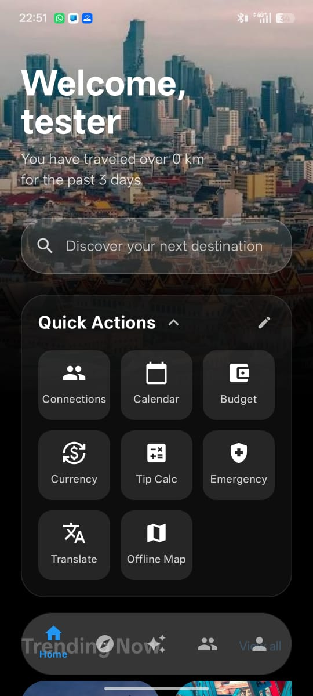
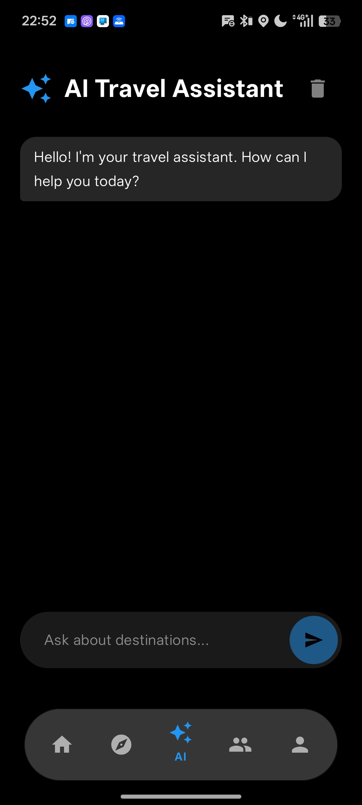
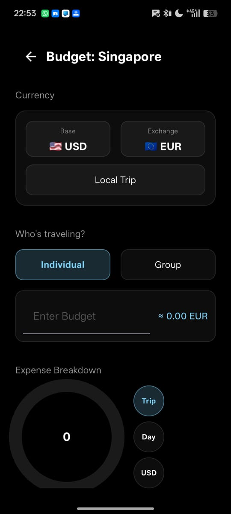
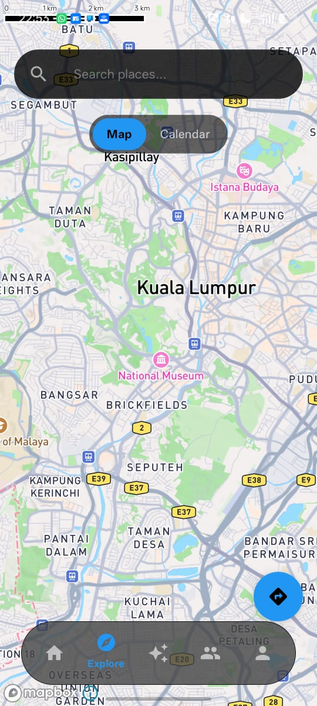
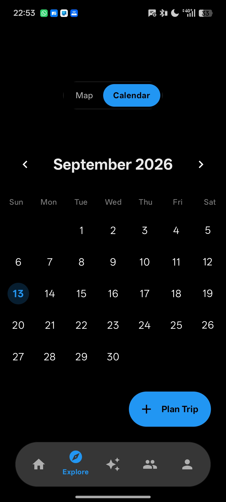
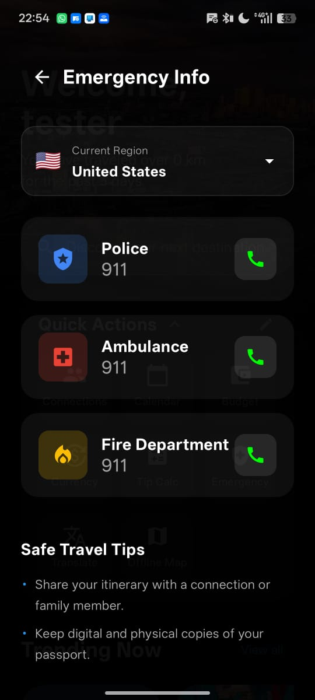
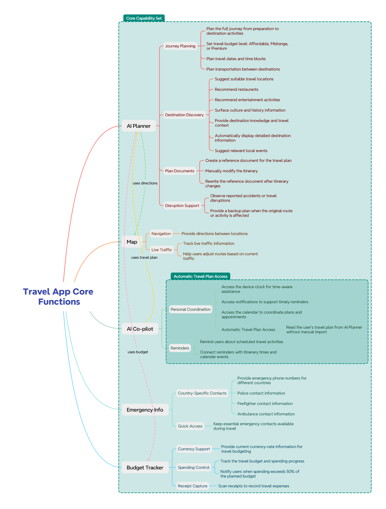

# Direction by Four Direction
**Team**: Tan Yi, Lee Jun Le, Kho Kian Bin, Shawn  
**Problem** **Statement**: Lifestyle Track: Planning an Escape (Travel Planner)  
**Video** **Presentation**:   
**Presentation** **Slides**:   

> **[Download Full PDF Presentation](./docs/all_directions.pdf)** | **[PowerPoint (.pptx)](./docs/all_directions.pptx)**

## 1. Project Overview

**The Problem:**  
Travelers often have to switch between multiple apps for different purposes, such as budget tracking, AI assistance, navigation, and social communication. This creates an inconvenient and fragmented experience, making it harder to manage everything in one place.

**Our Solution:**  
Our app is an **AI-centered travel ecosystem**. Unlike traditional planners, our AI acts as a central "Brain" that doesn't just recommend—it **executes**. By leveraging advanced AI orchestration, the platform automatically triggers app functions like the **Calendar** to schedule trips and the **Budget Planner** to allocate funds, providing a unified, hands-free experience that manages the complexity of travel in one place.

View Project Overview

---

# 2. Ideation & Process

## 2.1 Ideas We Considered

The following table summarizes the main ideas generated during our ideation process and explains why each idea was either selected or dropped.

| **Idea** | **Decision** | **Why It Was Kept / Dropped** |
|---|---|---|
| **A – Integrated Travel Planner** | ✅ Chosen | Combines multiple travel-related functions into one platform and directly addresses the problem of switching between different apps. |
| **B – AI Travel Assistant** | ✅ Chosen | Provides personalized travel recommendations and assistance, making trip planning more convenient and efficient. |
| **C – Booking Fligh, Hotel and Food Function** | ❌ Dropped | Obtaining those booking APIs requires negotiating with providers. Since this app is strictly for a competition and won't be released to actual users, we cannot offer them any commercial value, making it very difficult to secure the APIs. |

---

## 2.2 Ideation Boards

Our team used different ideation methods to explore the problem, generate possible solutions, and identify the most valuable features for our target users.

### Mindmap

View Mindmap

  

The mindmap shows how our team broke down the travel planning problem and explored different possible features and solutions.

### Problem Tree

View Problem Tree

  

The problem tree helped us identify the main problems faced by travelers, their underlying causes, and their potential effects.

### Additional Ideation Board

View Additional Ideation Board

  

This board shows the different ideas discussed by our team, including both selected and discarded ideas.

---

## 2.3 Mentor Consultation

| **Date** | **Mentor** | **Feedback Received** |
|---|---|---|---|
| 3/9/2026 | Jerod Tan | The slides contain many low-value images that fail to convey any useful information. Instead, the presentation should contrast our app's core functions with the current market landscape to highlight our competitive advantage. Additionally, it was suggested that we integrate AI into our app—specifically recommending some AI APIs—and that we shouldn't make the app entirely free. | 

---

# 3. Design & Prototype

## 3.1 UI Prototype

**Prototype Link:** [Insert Public Figma / Canva / Netlify / Vercel Link]

Our prototype demonstrates the main user flow and key features of the application.

### Key Screens

#### 1. Home Page

View Home Page

  

The home page provides users with quick access to the main functions of the application.

#### 2. AI Trip Planner

View AI Trip Planner

  

The AI Trip Planner helps users create and organize their travel plans based on their preferences and requirements. It also provides users with real-time assistance and travel-related recommendations.

#### 3. Budget Tracker

View Budget Tracker

  

The Budget Tracker allows users to monitor and manage their travel expenses in one place.

#### 4. Navigation / Map

View Navigation

  

The navigation feature helps users find and navigate to their destinations without switching to another application.

#### 5. In-app Calendar

View In-app Calendar

  

The in-app Calendar provides users a interactive way to plan a trip, while being able to collaborate with other people should users share the plan.

#### 6. Emergency Information

View Emergency Information

  

The Emergency Information feature provides users with important emergency-related information during their trip.

---

# 4. What Makes It Different

Our application is designed to differentiate itself from existing travel applications by combining multiple essential travel functions into a single platform.

| **Feature** | **Our Solution** | **What Makes It Different** |
|---|---|---|
| **Budget Planner** | A multi-traveler planning engine with smart templates (Backpacker to Luxury), safety buffer sliders, and live cost-per-day analysis. | Offers "peace of mind" via auto-calculated emergency funds and synchronizes custom categories globally across all user trips. |
| **Budget Tracker** | A real-time spending HUD with "Spending Pulse" ring visualizations and automated carry-over logic. | Intelligently calculates daily allowances by carrying over surpluses or deficits from previous days, turning a static plan into an active travel assistant. |
| **AI Trip Planner** | An intelligent orchestrator that generates full itineraries and automatically populates the app's **Calendar** and **Budget Planner**. | It doesn't just give text advice; it uses "App Functions" to build the actual trip structure for the user, eliminating manual entry. |
| **Navigation** | An integrated map service that provides turn-by-turn navigation directly to destinations found in the user's AI-planned itinerary. | Built directly into the ecosystem to ensure a seamless transition from planning to traveling without the friction of external apps. |
| **AI Co-pilot** | A real-time travel assistant that monitors your trip progress and spending health. | Acts as a proactive advisor that can suggest budget adjustments or route changes based on live data from the Tracker and Map. |
| **In-app Calendar** | An in-app calendar that is able to record plans such as planned locations to visit, hotels to stay at, and notes to keep track off. | Integration with **AI Trip Planner** and **Navigation**, allows the AI to update your plans, and view routes and photos in-app. Allows collaboration with other people in **Group Chat**, helping people in a group plan hassle free. |
| **Emergency Information** | A global database providing instant access to local emergency contacts like Police, Ambulance, and Fire Departments for multiple countries. | Designed for high-stress situations with an offline-first approach, ensuring critical help is just one tap away regardless of roaming data status. |
| **Group Chat** | A collaborative workspace where travelers can "connect" in real-time to discuss and build itineraries together. | Deeply integrated with the Calendar and Budgeting tools, allowing group members to vote on plans and view shared expenses within the conversation. |
| **Community** | A social platform for users to connect and exchange expert travel tips, destination guides, and general travel wisdom. | Leverages peer-verified "crowd knowledge" to help users discover hidden gems and local secrets that typical search engines might miss. |

View App Core Function

### Key Innovation

**Our main innovation is "AI-Led Orchestration."** Instead of a collection of isolated tools, the AI serves as a connective tissue. When the AI plans a trip, it autonomously "uses" the other features—setting up the Calendar, configuring the Budget Planner, and preparing Navigation—so the traveler can focus on the experience rather than the logistics.

---

# 5. Technical Architecture & Feasibility

## 5.1 Tech Stack

| **Category** | **Technology** | **Purpose** | **Why We Chose It** |
|---|---|---|---|
| **Frontend** | Jetpack Compose | Build the user interface | Modern, declarative toolkit that allows for highly decorative UIs and rapid development. |
| **Backend** | Firebase Auth / Ktor | Handle application logic and requests | Firebase provides seamless auth, while Ktor handles efficient networking for live services (e.g., currency rates). |
| **Database** | Cloud Firestore | Store user and application data | Real-time NoSQL database that enables instant synchronization across devices and collaborative planning. |
| **AI** | Gemini 3.6 Flash | Provide AI-powered features | Chosen for its exceptional speed and low latency, enabling the real-time "Orchestration" required for reactive trip planning. |
| **Maps / Navigation** | Mapbox SDK | Provide location and navigation services | Offers superior custom map styling and powerful search/routing APIs specifically for travel apps. |
| **Authentication** | Firebase Authentication | Manage user accounts and authentication | Secure, scalable solution that supports Email/Password and Google Sign-In out of the box. |
| **Hosting** | Render (Web Service) | Host the backend and API services | Provides a reliable and scalable environment for our microservices with automated deployment pipelines. |

---

## 5.2 APIs & External Services

| **Service / API** | **Purpose** | **Expected Constraints** |
|---|---|---|
| Mapbox Canvas API | Allows us to render visual space, allowing map data to be shown visually to all users. | There are rate limits per minute, which exceeding returns HTTP 429. |
| Google Places API (New) | Allows us to gather data such as photos and reviews about physical locations, businesses, landmarks, and points of interest (POIs) globally. | Using Googles Pay-as-you-go policy, we are only allowed limited request per month.|
| Google Gemini API | Allows us to use Google Gemini AI as a source of AI interactions. | We are limited to Flash and Flash-Lite models only as a free tier user, so we can only make typically 5–15 Requests per minute |

---

## 5.3 System Architecture

The system architecture illustrates how the frontend, backend, database, AI services, and external APIs interact with each other.

View System Architecture Diagram

  

---

## 5.4 Build Plan & Scope

During the building phase, we will focus on developing the core features that are essential to our proposed solution.

### Phase 1 – Core Application

- [x] Develop the main application interface
- [x] Implement user navigation
- [x] Set up the database
- [x] Implement user authentication

### Phase 2 – Main Features

- [x] Budget Planner & Tracker
- [x] AI Trip Planner
- [x] Map / Navigation
- [x] AI Co-pilot
- [x] Emergency Information
- [x] Group Chat
- [x] Community

### Phase 3 – Integration & Testing

- [x] Integrate all major features
- [x] Connect external APIs
- [x] Test the main user flows
- [x] Fix bugs and improve usability
- [x] Conduct final testing

### Project Scope

To ensure that the project remains realistic and feasible within the available development time, we will prioritize the **core functions** of the application rather than attempting to build every possible feature.

The minimum viable product (MVP) will focus on:

1. **AI Trip Planning**
2. **Budget Tracking**
3. **Navigation**
5. **AI Co-pilot**
6. **In-app Calendar**
7. **Emergency Information**

Additional features such as **Group Chat and Community** will be implemented based on the remaining development time and technical feasibility.

